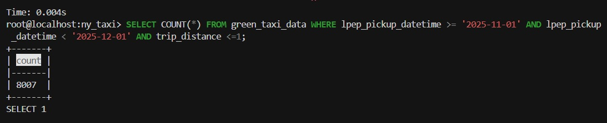
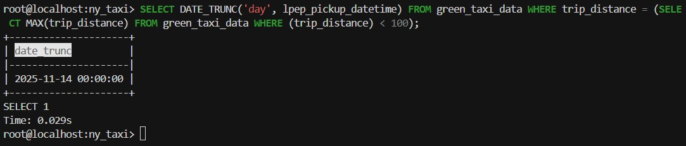

## Task 1
**Question**<br>
Run docker with the python:3.13 image. Use an entrypoint bash to interact with the container.
What's the version of pip in the image?<br>
**Solution**<br>
`docker run --rm -it --entrypoint bash python:3.13 -c "pip --version"`
<br>
**Answer**<br>
25.3<br>

## Task 2
**Question**<br>
Given the following `docker-compose.yaml`, what is the hostname and port that pgadmin should use to connect to the postgres database?
```yaml
services:
  db:
    container_name: postgres
    image: postgres:17-alpine
    environment:
      POSTGRES_USER: 'postgres'
      POSTGRES_PASSWORD: 'postgres'
      POSTGRES_DB: 'ny_taxi'
    ports:
      - '5433:5432'
    volumes:
      - vol-pgdata:/var/lib/postgresql/data

  pgadmin:
    container_name: pgadmin
    image: dpage/pgadmin4:latest
    environment:
      PGADMIN_DEFAULT_EMAIL: "pgadmin@pgadmin.com"
      PGADMIN_DEFAULT_PASSWORD: "pgadmin"
    ports:
      - "8080:80"
    volumes:
      - vol-pgadmin_data:/var/lib/pgadmin

volumes:
  vol-pgdata:
    name: vol-pgdata
  vol-pgadmin_data:
    name: vol-pgadmin_data
```
**Solution**<br>
Containers run within the same network. So pgadmin will use host of the service with postgres (`db`) and port, which is used within container with postgres (`5432`)<br>
**Answer**<br>
db:5432<br>

## Task 3
**Question**<br>
For the trips in November 2025 (lpep_pickup_datetime between '2025-11-01' and '2025-12-01', exclusive of the upper bound), how many trips had a `trip_distance` of less than or equal to 1 mile?<br>
**Solution**<br>
Steps:
- initialize virtual environment with uv;
- start docker container with postgres and connect to postgres database, ["learning materials"](https://github.com/DataTalksClub/data-engineering-zoomcamp/blob/main/01-docker-terraform/docker-sql/04-postgres-docker.md)
- create iterator for the parquet file with trips data and upload data to the new table in postgres database. Notebook with the code: ["notebook.ipynb"](https://github.com/ElenaNKn/data-engineering-zoomcamp-solutions/blob/master/homework_module1/notebook.ipynb)
- in terminal with connection to database execute command:<br>
`SELECT COUNT(*) FROM green_taxi_data WHERE lpep_pickup_datetime >= '2025-11-01' AND lpep_pickup_datetime < '2025-12-01' AND trip_distance <=1;`<br>

Result:<br>
<br>
**Answer**<br>
8007<br>

## Task 4
**Question**<br>
Which was the pick up day with the longest trip distance? Only consider trips with `trip_distance` less than 100 miles (to exclude data errors).<br>
**Solution**<br>
Steps are the same as for task 3. Final answer can be obtained with the command:<br>
`SELECT DATE_TRUNC('day', lpep_pickup_datetime) FROM green_taxi_data WHERE trip_distance = (SELECT MAX(trip_distance) FROM green_taxi_data WHERE (trip_distance) < 100);`<br>
Result:<br>
<br>
**Answer**<br>
2025-11-14<br>
